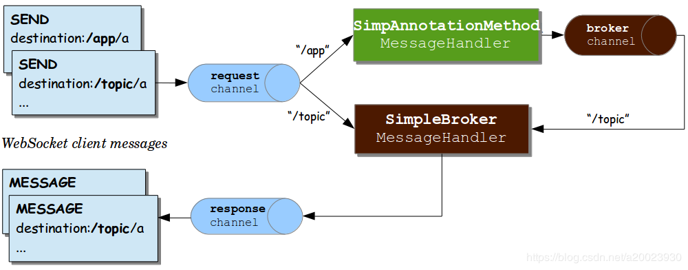
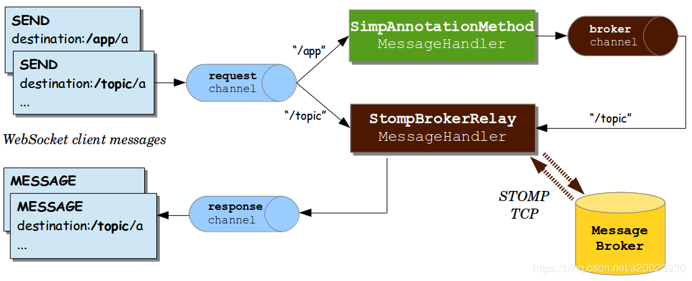

## Spring Boot WebSocket Appplication

基于[spring-boot-websocket-chat-demo](https://github.com/callicoder/spring-boot-websocket-chat-demo.git)，新增了更多基础案例。

## Requirements

1. Java - 1.8.x

2. Maven - 3.x.x

## Spring Websocket 原理图

